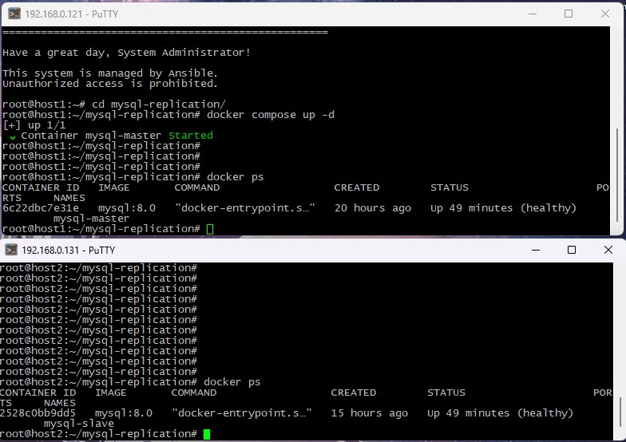
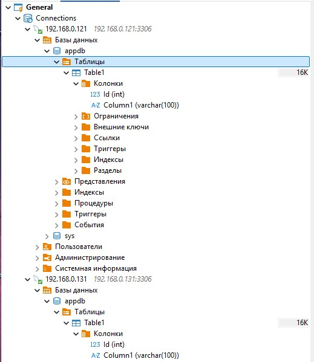

### Домашнее задание «Репликация и масштабирование. Часть 1» - Князев Евгений

# Задание 1 
На лекции рассматривались режимы репликации master-slave, master-master, опишите их различия.

Основное отличие - направление репликации. 
В режиме master-slave репликация однонаправленная, от master к slave. Данные записываются только на master, на slave данные писать нельзя, он только получает реплику от master.
В режиме master-master репликация двунаправленная. Данные могут записывать на любой master, а затем реплицироваться.

# Задание 2
Выполните конфигурацию master-slave репликации, примером можно пользоваться из лекции.

Были развернуты 2 виртуальные машины и на них подняты контейнеры с MySQL


После проведения настройки на master была создана таблица Table1 со столбцами Id и Column1. Данные изменения отобразились на slave, т.е. репликация работает


Настройки конфигурации:

host1 (Master, 192.168.0.121)

**master/my.cnf**<br>
[mysqld]
```
server-id = 1
log-bin = mysql-bin
binlog-format = ROW
binlog_expire_logs_seconds = 604800
innodb_flush_log_at_trx_commit = 1
sync_binlog = 1
bind-address = 0.0.0.0
```

**docker-compose.yml**<br>
```
services:
  mysql-master:
    image: mysql:8.0
    container_name: mysql-master
    network_mode: host
    environment:
      MYSQL_ROOT_PASSWORD: MasterRootPass123!
      MYSQL_DATABASE: appdb
      MYSQL_USER: appuser
      MYSQL_PASSWORD: AppPass123!
    volumes:
      - ./master/my.cnf:/etc/mysql/conf.d/replication.cnf
      - master_data:/var/lib/mysql
    healthcheck:
      test: ["CMD", "mysqladmin", "ping", "-h", "localhost", "-uroot", "-pMasterRootPass123!"]
      interval: 5s
      timeout: 3s
      retries: 10
volumes:
  master_data:
```  

host2 (Slave, 192.168.0.131)

**slave/my.cnf**<br>
```
[mysqld]
server-id = 2
relay-log = mysql-relay-bin
log-bin = mysql-bin
binlog-format = ROW
read-only = 1
super-read-only = 1
bind-address = 0.0.0.0
```

**docker-compose.yml**<br>
```
services:
  mysql-slave:
    image: mysql:8.0
    container_name: mysql-slave
    network_mode: host
    environment:
      MYSQL_ROOT_PASSWORD: SlaveRootPass123!
      MYSQL_DATABASE: appdb
      MYSQL_USER: appuser
      MYSQL_PASSWORD: AppPass123!
    volumes:
      - ./slave/my.cnf:/etc/mysql/conf.d/replication.cnf
      - slave_data:/var/lib/mysql
    healthcheck:
      test: ["CMD", "mysqladmin", "ping", "-h", "localhost", "-uroot", "-pSlaveRootPass123!"]
      interval: 5s
      timeout: 3s
      retries: 10
volumes:
  slave_data:
```

**Создание пользователя репликации на Master (host1)**<br>
```
sudo docker exec mysql-master mysql -uroot -pMasterRootPass123! -e "
CREATE USER 'replicator'@'192.168.0.131' IDENTIFIED WITH mysql_native_password BY 'ReplPass123!';
GRANT REPLICATION SLAVE ON *.* TO 'replicator'@'192.168.0.131';
FLUSH PRIVILEGES;
"
```

**Получение позиции бинлога на Master**<br>
```
sudo docker exec mysql-master mysql -uroot -pMasterRootPass123! -e "SHOW MASTER STATUS\G"
```

**Настройка Slave (host2)**<br>
```
sudo docker exec mysql-slave mysql -uroot -pSlaveRootPass123! -e "
STOP REPLICA;
CHANGE REPLICATION SOURCE TO
  SOURCE_HOST='192.168.0.121',
  SOURCE_USER='replicator',
  SOURCE_PASSWORD='ReplPass123!',
  SOURCE_LOG_FILE='mysql-bin.000003',
  SOURCE_LOG_POS=785;
START REPLICA;
"
```

**Создайте пользователя для удалённого подключения Dbeaver(решение ошибки - Access denied for user 'root'@'192.168.0.10' (using password: YES))**<br>
```
sudo docker exec -it mysql-slave mysql -uroot -pslavepass123 -e "
CREATE USER IF NOT EXISTS 'root'@'%' IDENTIFIED WITH mysql_native_password BY 'slavepass123';
GRANT ALL PRIVILEGES ON *.* TO 'root'@'%' WITH GRANT OPTION;
FLUSH PRIVILEGES;
"
```